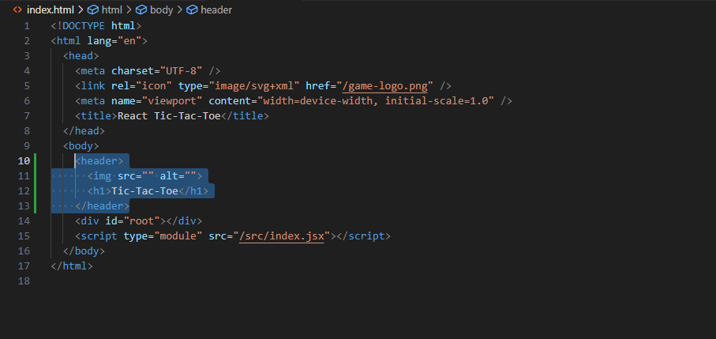
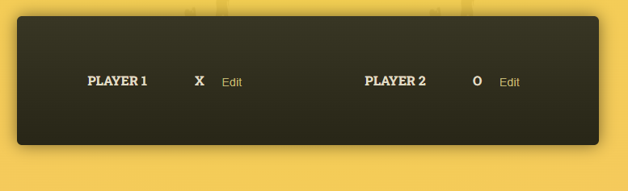

<h1>Tic tac toe documentation</h1>

<h2>In this project we will learn about topics like </h2>
-Multiple State Values  
-Lifting State up  
-Derived State  
-Nested Lists  
-Array & Object States 
-Component Functions vs Normal Function  

<h2>We will also learn about the</h2>
-Behind the scenes of JSX  
-Structuring Components and States  
-Patterns & Best Practices  

<h2>Not All Content Must Go Into Components</h2>

Not everthing has to go in the components. If we have a static elements like Header that we will never change then those can be added in the index.html

Example: Header tag is added directly in the index.html

<h2>Closer Look: public/ vs assets/ for Image Storage</h2>

*The public/ Folder*
As shown in the previous lecture you can store images in the public/ folder and then directly reference them from inside your index.html or index.css files.

The reason for that is that images (or, in general: files) stored in public/ are made publicly available by the underlying project development server & build process. Just like index.html, those files can directly be visited from inside the browser and can therefore also be requested by other files.

If you try loading localhost:5173/some-image.jpg, you'll be able to see that image (if it exists in the public/ folder, of course).

*The src/assets/ Folder*
You can also store images in the src/assets/ folder (or, actually, anywhere in the src folder).

*So what's the difference compared to public/?*

Any files (of any format) stored in src (or subfolders like src/assets/) are not made available to the public. They can't be accessed by website visitors. If you try loading localhost:5173/src/assets/some-image.jpg, you'll get an error.

Instead, files stored in src/ (and subfolders) can be used in your code files. Images imported into code files are then picked up by the underlying build process, potentially optimized, and kind of "injected" into the public/ folder right before serving the website. Links to those images are automatically generated and used in the places where you referenced the imported images.

*Which Folder Should You Use?*
You should use the public/ folder for any images that should not be handled by the build process and that should be generally available. Good candidates are images used directly in the index.html file or favicons.

On the other hand, images that are used inside of components should typically be stored in the src/ folder (e.g., in src/assets/).

<h2>Components instances work in isolation</h2>

Here we have tow instances of the player component. Both will hanve independent function.

